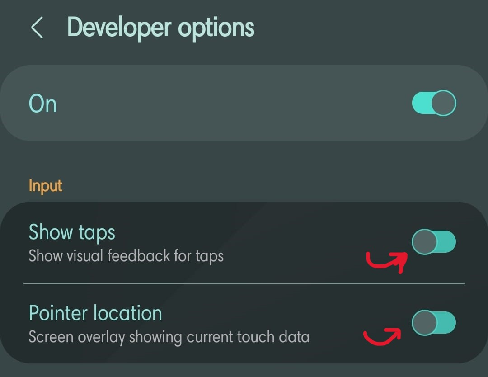
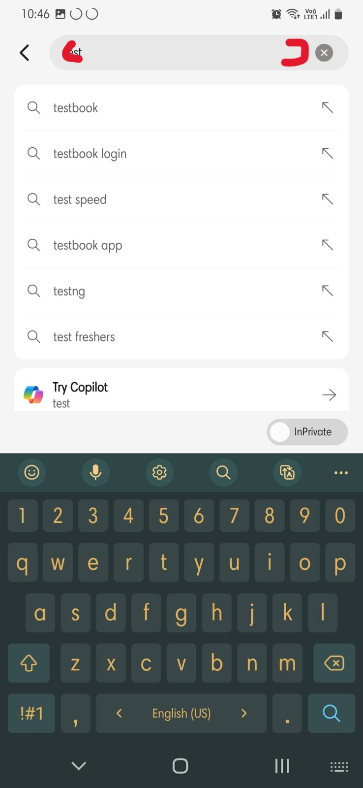
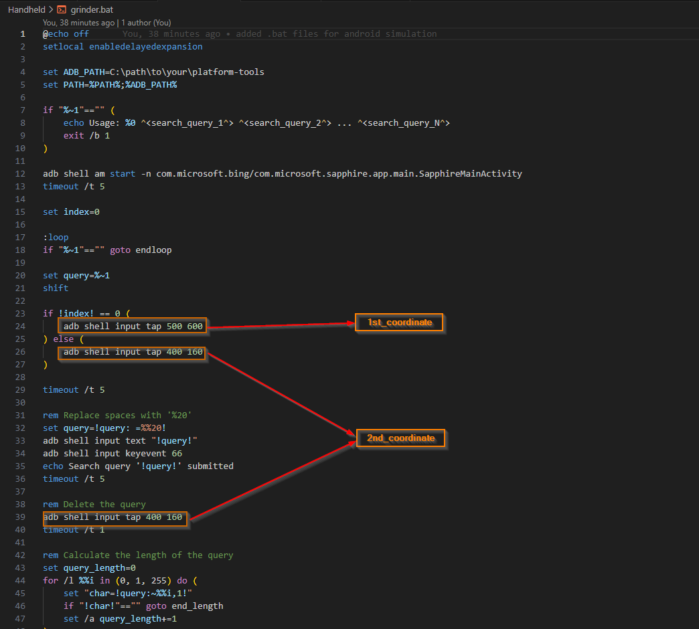

# MOTIVATION:

    - So ever heard of rewards program ?
    - If yes then you know you have to use edge browser in order to earn points.
    - But you dont prefer to use edge like me ? But still want to grind those points to claim those sweet giftcards?
    - WELL I GOT YOU BRO :)

# WHAT IT DOES?

    - Simple we use keystroke automation!!! i.e. Programmatically we send in keyboard inputs.
    - So each for each search we do we gain points. I just want the points but dont prefer to use this browser.
    - So at a stretch im just gonna claim all the point I can gain per day.

# HOW TO USE:

## PC:

**PREREQUISITES:**

    - Need a Microsoft account signed up for rewards program.
    - Microsoft edge installed.
    
 **STEPS:**
    
    - Go to chatgpt/ any AI of your choice. Type in the following: 
            "GIVE ME A PYTHON LIST OF STRING. THESE SEARCH PHRASES(STRINGS) MUSTN'T BE OF SAME TOPIC.
            THESE STRINGS MUST ATLEAST HAVE 3 WORDS. NUMBER OF SUCH STRINGS MUST BE 30."
    - Copy that list and replace "search_strings" in code.
    - Open a shell and run this .py file.
    - Wait till the program ends.
## ANDROID:

**PREREQUISITES:**

    - Need a PC with adb installed. Use the following link:
[ADB Installation GUIDE](https://www.xda-developers.com/install-adb-windows-macos-linux/)

    - An android phone, with bing app installed and your microsoft account logged in.
    - Developer options enabled (USB Debugging).
    
**STEPS:**

    .sh or.bat:
        - Open the script make sure you change the path needed to access adb
        - On your android device, got to developer options in settings and enable "Pointer Location":

        
        - Now open bing and get a coordiante within the specified regions as shown in the below images:

        - Replace the 1st_coordinate in the "if" condtion, and the 2nd_coordinate in the remaining spots as shown:\

        - Once you replace the coordinates and path for adb you are good to run the scripts.
        - Use 20 queries.
### SAMPLE RUN: 
                    
`sh: ./grinder.sh "query1" "query2"` 

`bat: grinder.bat "query1" "query2"` 

# +==================[DEV NOTES]=================+

## LATEST ITERATION (3.0):

    - Not much major changes wrt the previous functionality that was available.
    - New scripts(.sh and .bat) were added to perform search automation for mobile searches.
    - Mostly relied on adb shell commands to simulate the touch inputs.

## +==========================================================+

## ITERATION 2.0:

    - Remember the burden of closing al other desktop apps in foreground and keeping only edge open? Well no need to go throught 
    with it anymore.
    - Made use "subprocess" library to intiate msedge process and similarly terminate after task completion.
    - Used subprocess.run() and subprocess.terminate() which seemed to do the necessary.

## +==========================================================+

## ITERATION 1.0:

    - My naive approach, involved just taking a list of strings, which needs to be replaced on a daily basis.
    - Used pynput library to mimic the required keystrokes.
    - Had to introduce a time delay between each search, cause sometimes edge doesnt award you points if you do quick searches.

## +==========================================================+

